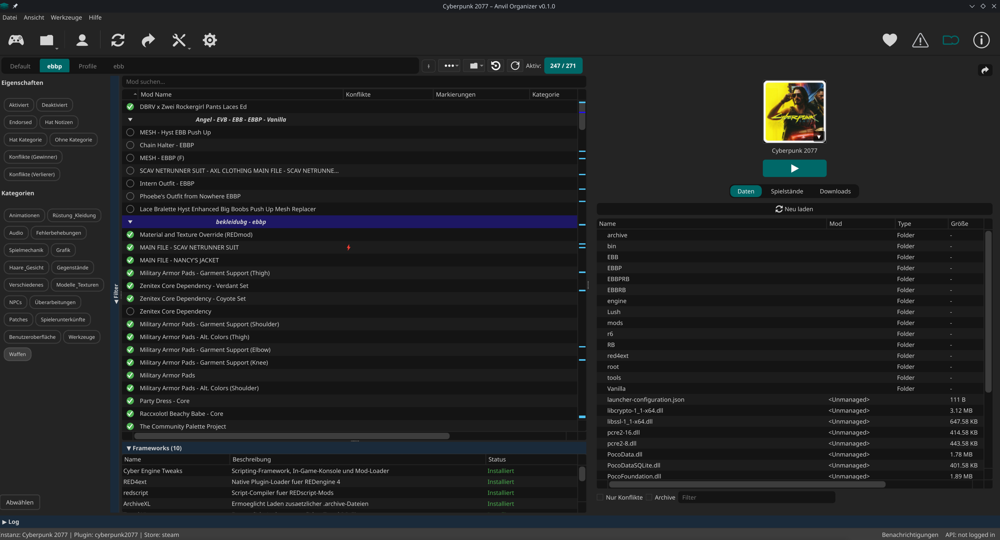
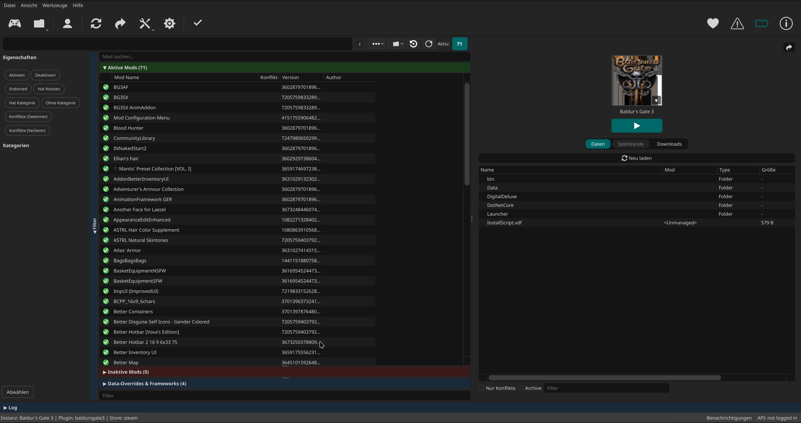
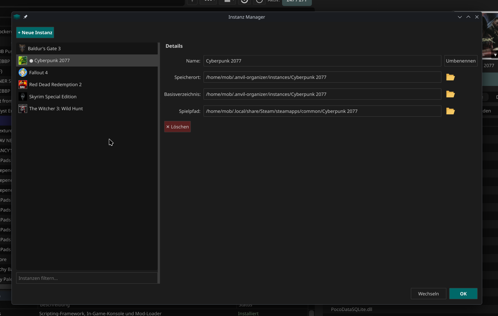
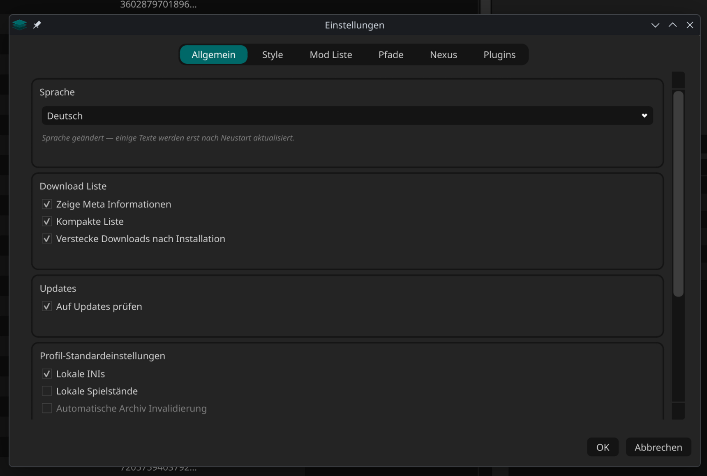

# 🔨 Anvil Organizer

A native **Linux mod manager** inspired by [Mod Organizer 2](https://github.com/ModOrganizer2/modorganizer), built with Python and PySide6 (Qt6).

MO2 dominates on Windows — Anvil fills the gap on Linux.


-green)


> ⚠️ **Early Development** — Anvil Organizer is under active development. Expect bugs and breaking changes. Feedback and bug reports are welcome!

---

## Features

- **MO2-style virtual file system** — mods never touch your game directory (symlink-based deploy)
- **Multi-instance support** — separate configurations per game
- **Profile system** — switch mod setups per game instance
- **Drag & drop mod ordering** — with collapsible separators and color coding
- **Category system** — primary + secondary categories, filter panel
- **Framework detection** — auto-detects and installs game frameworks
- **Nexus Mods integration** — NXM link handler, one-click downloads
- **Conflict detection** — shows file conflicts between mods
- **Self-update** — checks GitHub for updates, one-click git pull + restart
- **6 languages** — DE, EN, FR, ES, IT, PT
- **Dark theme** — multiple styles included

## Supported Games

| Game | Status | Notes |
|------|--------|-------|
| Cyberpunk 2077 | ✅ Working | REDmod, CET, ASI frameworks |
| Red Dead Redemption 2 | ✅ Working | ScriptHook, ASI Loader, LML |
| The Witcher 3: Wild Hunt | ✅ Working | Multi-folder routing (mods/dlc/bin) |
| Baldur's Gate 3 | ✅ Working | PAK mods, modsettings.lsx |
| Skyrim Special Edition | 🔧 Partial | Needs load-order system for .esp/.esm |
| Fallout 4 | 🔧 Partial | Needs load-order system for .esp/.esm |
| Starfield | 🔧 Partial | Needs load-order system for .esp/.esm |

Works with **Steam** and **Heroic Games Launcher** (GOG/Epic via Proton/Wine).

---

## Screenshots

<table>
  <tr>
    <td></td>
    <td></td>
  </tr>
  <tr>
    <td></td>
    <td></td>
  </tr>
</table>

---

## Installation

### Requirements

| Dependency | Check | Arch Linux | Debian / Ubuntu |
|------------|-------|------------|-----------------|
| **Python 3.11+** | `python3 --version` | `sudo pacman -S python` | `sudo apt install python3` |
| **pip** | `python3 -m pip --version` | `sudo pacman -S python-pip` | `sudo apt install python3-pip python3-venv` |
| **Git** | `git --version` | `sudo pacman -S git` | `sudo apt install git` |
| **Qt6 libraries** | `python3 -c "from PySide6 import QtWidgets"` | `sudo pacman -S qt6-base` | `sudo apt install libgl1 libegl1 libxcb-cursor0 libxkbcommon0` |

### Quick Install

```bash
git clone https://github.com/Marc1326/Anvil-Organizer.git
cd Anvil-Organizer
chmod +x install.sh
./install.sh
```

This creates a virtual environment, installs dependencies, and adds a desktop entry to your app menu.

### Manual Install

```bash
git clone https://github.com/Marc1326/Anvil-Organizer.git
cd Anvil-Organizer
python3 -m venv .venv
.venv/bin/pip install -r requirements.txt
.venv/bin/python main.py
```

---

## Updating

Anvil checks for updates on startup. When updates are available, a notification appears — click to update and restart automatically.

Manual update:

```bash
cd Anvil-Organizer
git pull
.venv/bin/pip install -r requirements.txt  # only if dependencies changed
```

---

## Project Structure

```
Anvil-Organizer/
├── main.py                 # Entry point
├── install.sh              # Install script
├── requirements.txt        # Python dependencies
├── pyproject.toml          # Project metadata
├── anvil/
│   ├── mainwindow.py       # Main window (MO2-style layout)
│   ├── core/               # Business logic
│   │   ├── mod_deployer.py     # Symlink-based virtual deploy
│   │   ├── mod_installer.py    # Archive extraction + installation
│   │   ├── instance_manager.py # Multi-game instance management
│   │   ├── update_checker.py   # Git-based self-update
│   │   └── ...
│   ├── plugins/games/      # Per-game plugins
│   │   ├── game_cyberpunk2077.py
│   │   ├── game_reddeadredemption2.py
│   │   ├── game_witcher3.py
│   │   ├── game_skyrimse.py
│   │   └── ...
│   ├── widgets/            # UI components
│   ├── styles/             # Dark themes (QSS)
│   ├── i18n/               # Translations (6 languages)
│   └── assets/icons/       # Game icons and covers
```

---

## How It Works

Anvil uses a **symlink-based virtual file system** similar to MO2:

1. Mods are stored in `.mods/` inside each instance directory
2. On game launch, Anvil creates symlinks from the game directory to your mods
3. On game close (or app exit), symlinks are removed
4. **Your game directory stays clean** — no files are ever copied or modified

This approach works natively on Linux without the need for a virtual filesystem driver.

---

## Contributing

Contributions welcome! Please open an issue first to discuss what you'd like to change.

---

## Support the Project

If Anvil Organizer is useful to you, consider supporting its development:

☕ **Ko-fi:** [ko-fi.com/marc1326](https://ko-fi.com/marc1326)

**Crypto:**
- **Bitcoin:** `bc1q6ghal7tewh38gdggt8z8qeqr99u3y5ehmruwk9`
- **Monero:** `4AGPyk5G4NwZboyQJcWQKwMFLTjs3fmoG9CFVBrkE3UFcpCaQyEmC93PgaeW1uuL65aLW1qKa8sd4Wo6NSu4HkvF117n5km`

---

## License

[GPL-3.0](LICENSE)

---

## Acknowledgments

- Inspired by [Mod Organizer 2](https://github.com/ModOrganizer2/modorganizer)
- Built with [PySide6](https://doc.qt.io/qtforpython-6/) (Qt for Python)
